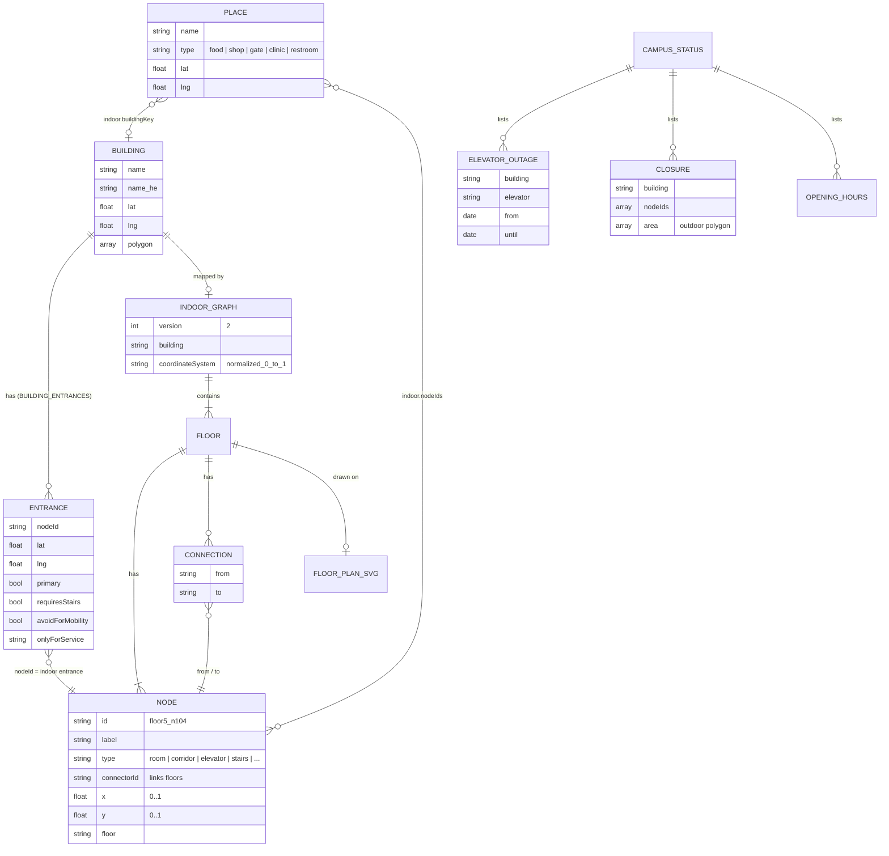

# 08 · Data model

> Every data structure CampusWay uses: campus buildings, places and entrances (`data.js`), the indoor graph JSON format, floor plans, the outdoor path network, the live campus-status file, browser storage keys, URL parameters, and statistics about the mapped data.

**Contents:** [Overview](#1-overview) · [Campus data](#2-campus-data-appprototypedatajs) · [Indoor graphs](#3-indoor-graphs) · [Outdoor path network](#4-outdoor-path-network) · [Campus status file](#5-campus-status-file) · [Browser storage keys](#6-browser-storage-keys) · [URL parameters](#7-url-parameters) · [Data statistics](#8-data-statistics)

---

## 1. Overview



<sub>Diagram source: [`diagrams/09-data-model.mmd`](diagrams/09-data-model.mmd) · Image: [PNG](diagrams/09-data-model.png) · [SVG](diagrams/09-data-model.svg)</sub>

| Data | File | Format | Edited with |
|---|---|---|---|
| Buildings, places, gates, restrooms | `app/prototype/data.js` | JavaScript object `CAMPUS_DATA` | Text editor |
| Hebrew place names | `app/prototype/data.js` | `PLACE_NAMES_HE` | Text editor |
| Building entrances | `app/prototype/data.js` | `BUILDING_ENTRANCES` | Text editor |
| Indoor graphs | `buildings/<key>/<key>-indoor-graph.json` | JSON | WayFrame node plotter |
| Floor plans | `buildings/<key>/floors/*.svg` | SVG drawings | External drawing tools |
| Outdoor paths | `app/prototype/campus-osm.json` | Overpass API JSON | Re-export from OpenStreetMap |
| Outdoor corrections | `app/prototype/outdoor-routing.js` | Code (`addCampusNode`, `addEdge`, `removeEdge`) | Text editor |
| Live status | `app/data/campus-status.json` | JSON | Text editor |

**Building keys** link the data together: `main`, `rabin`, `madriga` (Terrace Building), `student`, `multi-purpose`, `education`.

## 2. Campus data (`app/prototype/data.js`)

### 2.1 `CAMPUS_DATA.buildings[]`

| Field | Type | Description |
|---|---|---|
| `name` | string | English name (also used as an identifier in share links) |
| `name_he` | string | Hebrew name |
| `lat`, `lng` | number | Marker position |
| `polygon` | `[lat, lng][]` | Building outline |

### 2.2 `CAMPUS_DATA.points`

| Collection | Count | Fields |
|---|---|---|
| `food` | 10 | `name`, `lat`, `lng`, `type: "food"`, optional `indoor: {buildingKey, nodeIds[]}` (8 places are linked to indoor nodes) |
| `shops` | 7 | same as food (1 linked indoors: Yozma, Student House) |
| `gates` | 2 | Carmel Gate (south, default start) and Haifa (Denya) Gate (north) |
| `clinic` | 1 | University Clinic |
| `restrooms` | 73 | outdoor reference points per building |
| `parking` | 0 | reserved |

```js
{ "name": "Aroma Espresso Bar", "lat": 32.76126, "lng": 35.02086, "type": "food",
  "indoor": { "buildingKey": "rabin", "nodeIds": ["floor6_n70", "floor6_n71", "floor6_n72"] } }
```

### 2.3 `BUILDING_ENTRANCES`

A map from building key to its entrances (22 in total, under 10 keys). For the six mapped buildings, `nodeId` is the entrance node in the indoor graph; for the four outdoor-only buildings (`health`, `eshkol`, `art`, `bloom`) it is an outdoor `campus_*` label. `lat`/`lng` is where the outdoor route connects.

| Field | Type | Description |
|---|---|---|
| `nodeId` | string | Indoor entrance node, e.g. `floor1_n49` |
| `lat`, `lng` | number | Outdoor connection point |
| `primary` | bool | Default entrance |
| `requiresStairs` | bool | Not used for Mobility routing |
| `avoidForMobility` | bool | Not used for Mobility routing |
| `onlyForService` | string | Reserved for one service, e.g. `"gym"`; never used as a destination entrance |

```js
madriga: [
  { nodeId: 'floor1_n49', lat: 32.760836, lng: 35.021125, primary: true },
  { nodeId: 'floorminus1_n1', lat: 32.760864, lng: 35.021283, onlyForService: 'gym' },
  …
]
```

## 3. Indoor graphs

### 3.1 File format

```json
{
  "version": 2,
  "building": "rabin",
  "coordinateSystem": "normalized_0_to_1",
  "floors": {
    "floor5": {
      "nodes": [
        { "id": "floor5_n0",   "label": "5007",     "type": "room",     "connectorId": "",          "x": 0.454448, "y": 0.861378, "floor": "floor5" },
        { "id": "floor5_n104", "label": "elevator", "type": "elevator", "connectorId": "elevator1", "x": 0.722649, "y": 0.492619, "floor": "floor5" }
      ],
      "connections": [ { "from": "floor5_n137", "to": "floor5_n104" } ],
      "nextNodeId": 205
    }
  }
}
```

### 3.2 Node fields

| Field | Description |
|---|---|
| `id` | Unique ID, `<floorId>_n<number>`, e.g. `floor600_n86`, `floorminus1_n1` |
| `label` | Room number or name shown to users (e.g. `5007`, `Hecht Museum`) |
| `type` | One of the node types below |
| `connectorId` | For `stairs` and `elevator`: nodes with the same ID on different floors are the same stairwell or shaft. Empty for other types. |
| `x`, `y` | Position as a fraction (0–1) of the floor-plan width and height |
| `floor` | Floor ID: `floorminus1`, `floor0` … `floor7`, `floor500`, `floor600`, `floor700` |

### 3.3 Node types

| Type | Count (all buildings) | Role |
|---|---|---|
| `corridor` | 1,539 | Walkable junctions and bends |
| `room` | 1,126 | Destinations (classrooms, offices, labs) |
| `stairs` | 147 | Vertical connector (excluded in step-free routing) |
| `restroom` | 63 | Service destination |
| `elevator` | 47 | Vertical connector |
| `entrance` | 34 | Building doors; used for indoor ↔ outdoor hand-off |
| `shelter` | 20 | Protected spaces for emergency routing |
| `landmark` | 15 | Notable places; rest-space candidates |
| `food` | 9 | Cafés and food counters |
| `parking` | 3 | Parking entrances |
| `gym`, `clinic`, `museum`, `library` | 1 each | Service destinations |

### 3.4 Connections and floors

- `connections` are undirected `{from, to}` pairs on the same floor. They store no length; length is computed from coordinates.
- Floor changes are **implicit**: stairs and elevator nodes sharing a `connectorId` are linked between adjacent mapped floors.
- `nextNodeId` is the WayFrame editor's counter for new IDs.

### 3.5 Floor plans

`buildings/<key>/floors/` holds one SVG per floor, named `floor<n>.svg`, `floorminus1.svg`, or `<n>-Model.svg` for Main Building. Node coordinates are relative to the drawing, so a graph and its floor plan must stay together. If a plan is replaced with a different crop or aspect ratio, the nodes must be re-placed.

### 3.6 Duplicated graph copies

`app/prototype/madriga-graph.js` and `multi-purpose-graph.js` hold JavaScript copies of two graphs (`MADRIGA_GRAPH`, `MULTI_PURPOSE_GRAPH`) that the campus page uses for search and services. When a JSON graph is updated, these copies must be updated too. At the time of writing the Terrace copy matches its JSON file, but the Multi-Purpose copy is older (305 nodes, no connections) than `multi-purpose-indoor-graph.json` (359 nodes, 307 connections).

## 4. Outdoor path network

| Item | Format |
|---|---|
| `campus-osm.json` | Overpass API output: `elements[]` with `type: "node"` (`id`, `lat`, `lon`) and `type: "way"` (`nodes[]`, `tags.highway`) |
| Campus corrections | `addCampusNode('campus_<name>', lat, lng)`, `addEdge(a, b, type)`, `removeEdge(a, b)` calls in `applyCampusCorrections()` |
| Edge types | `footway`, `pedestrian`, `path`, `living_street`, `steps`, `service`, `residential`, `elevator` |

The data is © OpenStreetMap contributors, available under the Open Database Licence (ODbL).

## 5. Campus status file

`app/data/campus-status.json` is maintained by hand. The app reads it every time it opens (network first) and keeps the last copy for offline use.

```json
{
  "updated": "2026-10-04",
  "elevators": [
    { "building": "rabin", "elevator": "2", "status": "out-of-service",
      "from": "2026-10-04", "until": "2026-10-12", "note": "Maintenance" }
  ],
  "closures": [
    { "building": "main", "nodeIds": ["floor600_n12"], "reason": "Construction", "until": "2026-11-01" },
    { "area": [[32.7621, 35.0201], [32.7622, 35.0203], [32.7620, 35.0204]], "reason": "Construction", "until": "2026-11-01" }
  ],
  "openingHours": {
    "Cafe Aguda": { "sun": "07:30-18:00", "mon": "07:30-18:00", "tue": "07:30-18:00",
                    "wed": "07:30-18:00", "thu": "07:30-18:00", "fri": "07:30-12:00", "sat": "closed" }
  },
  "reportEmail": "facilities@example.ac.il"
}
```

| Section | Notes |
|---|---|
| `elevators` | `building` is a building key, or `"campus"` with `"elevator": "main-600-outdoor"` for the outdoor elevator. An entry is active from `from` 00:00 to `until` 23:59:59. |
| `closures` | Indoor: `building` + `nodeIds`. Outdoor no-go zone: `area` polygon. |
| `openingHours` | Keyed by the English place name or the indoor label. Several ranges are separated by commas; `"24/7"` is allowed. |
| `reportEmail` | Shows an e-mail button after a problem report. Leave it empty to hide the button. |
| `noiseAreas` | Outdoor path points the Rest-space profile avoids while `noisy` or `crowded`, until `until`. |
| `announcements` | Banners: `{id, severity: "info" \| "warning" \| "critical", text: {en, he, ar, ru}, from, until}`. English is shown when a language is missing. |
| `emergency` | `{active, message: {en, he, ar, ru}}`. When active, every page shows a red banner with a *Nearest shelter* button. |
| `names` | Name corrections keyed by the English name: `{"Cafe Aguda": {"ar": "…"}}`. They replace the built-in name in that language. |

The admin screen ([17 · Admin screen](17-admin-screen.md)) edits this file and checks it with `app/admin/status-schema.js` before saving.

The live file currently lists no outages, closures or hours.

## 6. Browser storage keys

### `sessionStorage` (per tab)

| Key | Written by | Content |
|---|---|---|
| `campuswayLanguage` | campus map | `en`, `he` or `ar` |
| `accessibilityProfile` | campus map | `general`, `mobility`, `visual`, `spatial` or `mental` |
| `journeyStage` | both | `origin`, `destination`, `same-building` or `intermediate` |
| `indoorBuilding` | both | Building key for the indoor page |
| `indoorContext` | campus map | Destination: `{destinationNodeId, destinationLabel, destinationDisplayLabel, destinationType, buildingKey, entranceId, startNodeId}` |
| `indoorStartContext` | campus map | Origin: `{buildingKey, startNodeId, exitEntranceId, label}` |
| `outdoorJourneyContext` | campus map | Snapshot used to rebuild the outdoor leg after the origin leg |
| `sharedIndoorTransfer` | campus map | `{originBuilding, destinationBuilding, method}` (Rabin ↔ Terrace) |
| `intermediateIndoorTransfer` | campus map | Rabin pass-through leg on the Main → Terrace chain |
| `originIndoorComplete` | indoor page | Signals the campus map to resume the journey |
| `campusTransitionDirection` | indoor page | Shows the "switching to outdoor" overlay |
| `sharedNavigationResume` | indoor page | `{building, mode}`: continue navigation in the next building |
| `madrigaTransferEntrance` | indoor page | Arrival node in Terrace after the transfer |
| `campusway.pendingSharedElevatorRide` | indoor page | Elevator ride in progress across buildings |

### `localStorage` (persistent)

| Key | Content |
|---|---|
| `campusway.favourites.v1` | Array of `{kind: "place", name, lat, lng}` or `{kind: "indoor", name, nodeId, type, buildingKey, buildingName, floor}` |
| `campusway.audioEnabled` | Audio guide on or off (written by the campus map; currently read only by the audio test page) |
| `campusway.legendOpen` | Map key open or closed |
| `campuswayIndoorVoice` | Indoor voice guidance `on` or `off` |
| `campuswayReports` | Problem reports made on this device (up to 50, kept 14 days) |
| `campuswayStatusCache` | Last downloaded campus-status file |
| `campusway_wayframe_v2_<building>` | WayFrame editor autosave (developer tool) |

## 7. URL parameters

| Page | Parameter | Example | Effect |
|---|---|---|---|
| `index.html` | `from`, `to` | `?from=building:Rabin%20Building&to=room:madriga:floor1_n6` | Opens with this route (share links). Values are `building:<name>`, `room:<buildingKey>:<nodeId>` or `place:<name>`. |
| `index.html` | `emergency=1` | `?emergency=1&from=building:Main%20Building` | Starts nearest-shelter routing |
| `index.html` | `resumeJourney=1` | | Used by the indoor page to resume the outdoor leg |
| `index.html` | `debug` | `?debug` | Clicking the map shows coordinates |
| `navigation-demo.html` | `building` | `?building=rabin` | Building to load |
| `navigation-demo.html` | `from`, `to` | `?building=rabin&from=floor7_n108&to=floor5_n0` | Opens with this indoor route |

## 8. Data statistics

### Indoor graphs

| Building (key) | Floors with nodes | Nodes | Connections | Room nodes | Elevator / stair nodes | Entrance nodes | Restrooms | Shelters |
|---|---|---|---|---|---|---|---|---|
| Main Building (`main`) | 500, 600, 700 | 415 | 422 | 124 | 3 / 24 | 9 | 15 | 0 |
| Rabin Building (`rabin`) | 5, 6, 7 | 593 | 605 | 202 | 12 / 40 | 8 | 5 | 4 |
| Terrace Building (`madriga`) | −1, 0, 1, 2, 3, 4 | 484 | 476 | 189 | 8 / 19 | 4 | 8 | 0 |
| Student House (`student`) | 0–4 | 405 | 405 | 141 | 10 / 36 | 5 | 5 | 1 |
| Multi-Purpose (`multi-purpose`) | 0, 1 | 359 | 307 | 180 | 2 / 8 | 7 | 2 | 1 |
| Education and Science (`education`) | 1–6 | 751 | 754 | 290 | 12 / 20 | 1 | 28 | 14 |
| **Total** | | **3,007** | **2,969** | **1,126** | **47 / 147** | **34** | **63** | **20** |

### Outdoor network and places

| Item | Count |
|---|---|
| OSM nodes / ways in the extract | 947 / 157 |
| Routing nodes / edges after corrections | 1,064 / 1,089 |
| Buildings on the map | 10 |
| Building entrances | 22 |
| Food places / shops / gates / clinic | 10 / 7 / 2 / 1 |
| Floor-plan SVGs | 28 (about 92 MB) |
