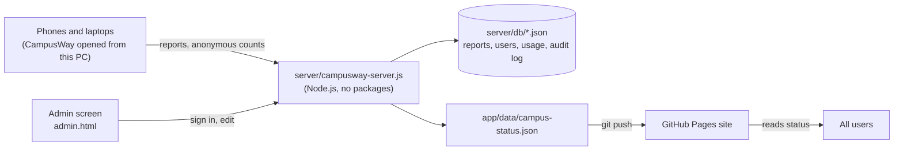

# 17 · Admin screen and local server

> The admin screen (`admin.html`) lets the campus team handle problem reports and keep the live campus status up to date without editing JSON by hand. It runs on one PC, with a small server that comes with CampusWay and saves to plain JSON files. No database account, cloud service or payment is involved.

**Contents:** [How it works](#1-how-it-works) · [Starting it](#2-starting-it) · [Pages](#3-pages) · [Roles](#4-roles) · [Where data is kept](#5-where-data-is-kept) · [Publishing to the live site](#6-publishing-to-the-live-site) · [Privacy and security](#7-privacy-and-security) · [Cloud inbox](#8-reports-from-the-public-site-the-cloud-inbox) · [Limits](#9-limits)

## 1. How it works



- The server is one Node.js file that uses only built-in modules. It serves the app (replacing `http-server`) and a small API.
- The app works exactly as before when the server is not there. On GitHub Pages it sends nothing unless the optional [cloud inbox](#8-reports-from-the-public-site-the-cloud-inbox) is set up; otherwise reports stay on the device.
- When the app is opened from the server (for example `http://localhost:8080` or `http://<PC address>:8080` on the same Wi-Fi), problem reports and anonymous usage counts are also sent to the PC. Reports made while the PC is unreachable are sent the next time the app opens.
- The admin screen writes `app/data/campus-status.json`, the same file the app already reads. Committing and pushing it publishes the change to everyone.

## 2. Starting it

Requires [Node.js](https://nodejs.org) 18 or newer. From the project folder:

```powershell
node server/campusway-server.js
```

Or double-click `start-admin.bat` on Windows. Then open:

- App: http://localhost:8080/
- Admin: http://localhost:8080/admin.html

The first time, the admin screen asks you to create the first administrator. This only works on the PC that runs the server.

| Option | Effect |
|---|---|
| `--lan` | Phones and computers on the same network can open the app and send reports (the server prints the address). |
| `--lan-admin` | Also allows the admin screen from other computers. Passwords travel unencrypted on the network, so use it only on a trusted network. |
| `--port 8081` | Use another port. |
| `--no-usage` | Do not collect anonymous usage counts. |
| `--db <folder>` | Keep the database somewhere else (default `server/db`). |
| `--status-file <file>` | Edit another status file, for example a copy for testing. |
| `--cloud-minutes 10` | How often to fetch from the cloud inbox (default 5; 0 = only with **Fetch now**). |
| `--max-data-gb 10` | Storage limit for CampusWay's data on this PC (default 10 GB). |

Phone sensors need HTTPS, so test indoor sensor navigation on the GitHub Pages site. Reports and everything else work over the local address.

## 3. Pages

| Page | What it does |
|---|---|
| **Overview** | New reports, active outages and closures, announcements, emergency state, data-health summary, and whether the status file has changes that are not on GitHub yet. |
| **Reports** | Inbox of problem reports with filters, search and grouping of similar reports. Each report has a status (New → Acknowledged → In progress → Resolved / Rejected), an assignee, an internal note and a history. Bulk updates, CSV export, reports entered by hand (phone, e-mail, in person), and median response and fix times. **Make it official** turns a report into an elevator outage, indoor closure, outdoor zone or announcement; when that is saved, the report moves to *In progress*. When the app runs from the server, reporters see the status of their own reports in the report dialog. |
| **Live status** | Elevator outages (chosen from the elevators in the indoor maps), indoor closures (picked by clicking places on the floor plan), outdoor no-go zones (drawn on the map) and noisy areas (path points the Rest-space profile avoids). Every editor previews the effect: which places lose their route or their step-free route, and which gate-to-building routes get longer or blocked. |
| **Announcements** | Banners on the campus map and indoor pages in English, Hebrew, Arabic and Russian, with an end date. Information and warning banners can be dismissed; critical ones cannot. **Emergency mode** shows a red banner with a *Nearest shelter* button on every page. The report e-mail is set here too. |
| **Content** | Name corrections for buildings, food places and shops in Hebrew, Arabic and Russian (with the built-in names shown for comparison and filters for missing languages), and weekly opening hours. |
| **Data health** | Automatic checks on the indoor maps: isolated nodes, stairs and elevators without a connector id, connectors on a single floor, placeholder names, missing entrances, places that cannot be reached, and places reachable only by stairs, per building and floor. *Show on map* highlights the nodes on the floor plan. CSV export. |
| **Storage** | CampusWay's data on this PC against the 10 GB limit, file by file; the cloud inbox's database size, waiting reports and today's numbers against its caps; and how the Cloudflare account stays free. |
| **Cloud inbox** | Set-up steps for the free cloud inbox, its connection status, the last fetch and **Fetch now** (see [section 8](#8-reports-from-the-public-site-the-cloud-inbox)). |
| **Insights** | Anonymous counts: app opens, route requests per day, top destinations, searches that found nothing, destinations without a step-free route, languages, profiles, indoor navigation modes and report types. |
| **Tests** (administrators) | **Run tests** runs every file in `tests/` on this PC with Node's test runner (four files at a time) and shows the totals (passed, failed, skipped, time), each file's result, and for each failure its error message and the raw output. Only the fixed test files run; nothing from the page reaches the command. The last run is kept in `server/db/tests.json`. |
| **Admins & history** | Activity log (who changed what), every earlier version of the status file with *Restore*, admin accounts and roles, and password change. |

All status changes go into a **draft**. The bar at the bottom lists what changed; **Save to live status** checks the draft (the same rules run in the browser and on the server), keeps a backup of the old file and writes the new one. If someone else saved in the meantime, the save is refused instead of overwriting their change.

## 4. Roles

| Role | Can change |
|---|---|
| Administrator | Everything, including emergency mode, admin accounts and restoring old versions |
| Facilities | Reports, elevator outages, closures, noisy areas, announcements, report e-mail |
| Accessibility office | Reports, elevator outages, closures, noisy areas |
| Content editor | Place names, opening hours, announcements |

Everyone who can sign in can view every page. The server checks the role on every change, so a content editor cannot change outages even by calling the API directly.

## 5. Where data is kept

Everything is in `server/db/`, which is listed in `.gitignore` and never committed.

| File | Contents |
|---|---|
| `users.json` | Admin accounts. Passwords are stored as salted scrypt hashes. |
| `reports.json` | Problem reports with their status, assignee, internal note and history (up to 5,000). |
| `usage.json` | Anonymous counts per day (kept for about 400 days). |
| `audit.json` | Activity log (up to 5,000 entries). |
| `status-history/` | The status file as it was before each save (last 200). |
| `cloud.json` | Cloud inbox address and sync key, last fetch, and any batch not yet confirmed. |

The files are plain JSON: you can open them, back them up by copying the folder, or move them to another PC. Each write goes to a temporary file first, so a crash never leaves a half-written file.

**Storage limit.** Everything CampusWay stores on the PC (this folder plus the live status file) is limited to 10 GB (`--max-data-gb` changes it). At the limit, new reports, usage counts and cloud fetches stop, while phones and the cloud inbox keep their data until there is room; admin edits keep working. Each kind of data also has its own cap (5,000 reports, 5,000 log entries, about 400 days of counts, 200 backups), so in practice the folder stays in the megabytes. The **Storage** page shows the size of each file against the limit, the free space on the drive, and the cloud inbox's storage and daily numbers.

## 6. Publishing to the live site

The GitHub Pages site reads `app/data/campus-status.json` from the repository. After saving in the admin screen:

```powershell
git add app/data/campus-status.json
git commit -m "Update campus status"
git push
```

The Overview page reminds you when the file has unpublished changes. Devices that open CampusWay from the PC see changes immediately.

## 7. Privacy and security

- Usage counts contain no names, device ids, locations or times of day: only "this destination was requested N times on this date". Search terms that found nothing are stored as typed (up to 80 characters).
- Reports contain what the reporter chose and wrote; the free-text note is limited to 500 characters.
- The server never serves `server/`, `.git` or hidden files.
- The admin API works only from the PC itself unless started with `--lan-admin`. It requires a session cookie (HttpOnly, SameSite=Strict) and a custom header, and refuses cross-site requests.
- Sign-in is limited to 10 attempts per 15 minutes per address; reports to 30 per hour per address.

## 8. Reports from the public site: the cloud inbox

Phones using the GitHub Pages site cannot reach the PC. The optional **cloud inbox** ([`cloud/`](../cloud/README.md)) is a free Cloudflare Worker that collects their reports and usage counts until the PC fetches them:

- The app sends to the PC server when it was opened from it, otherwise to the inbox named by `reportEndpoint` in the status file, otherwise it keeps reports on the phone.
- While the server runs, it fetches from the inbox every 5 minutes (`--cloud-minutes` changes this; **Fetch now** on the Cloud inbox and Reports pages does it at once). Each fetch also sends report statuses back, so reporters on the public site see "Fixed".
- The PC confirms each batch; only then does the inbox delete the report text. An unconfirmed batch is remembered in `server/db/cloud.json` and confirmed on the next fetch, so nothing is lost or counted twice if the connection drops.
- The inbox address and sync key are kept in `server/db/cloud.json`, never in the project files.

Setting it up takes about 15 minutes and a free Cloudflare account; the **Cloud inbox** page in the admin screen walks through it.

## 9. Limits

- Without the cloud inbox, reports from the GitHub Pages site stay on the reporter's phone.
- Reports in the cloud inbox reach the admin screen only when the PC is on; they wait in the inbox (up to 90 days) until then.
- The admin screen edits live status and names. Indoor maps are still edited in the WayFrame editor (see [13 · Developer tools](13-developer-tools-and-mapping.md)).
